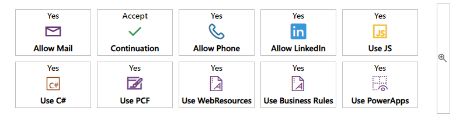
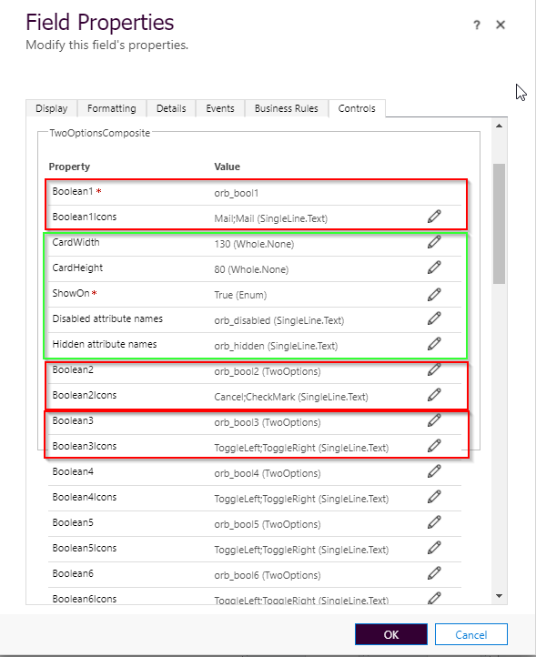

# TwoOptionsComposite

This PCF controls makes it easier to work with a bunch of TwoOptions (Booleans). It can include up to 30 TwoOptions (boolean) attributes.
It offers the possibility to automatically hide attributes based on the value. Have a look:

<video width="600" height="400" controls>
  <source src="./Docs/imgs/TwoOptionsComposite.mp4" type="video/mp4">
  Your browser does not support the video tag.
</video>

## Configuration

You can choose up to 30 TwoOption attributes, named "Boolean1", "Boolean2" .. "Boolean30". For each of them there is an additional property "Boolean1Icons".."Boolean30Icons", where you can define the Icons: the one for false/no (left) and the one for true/true (right). 

Showing only the "true/yes" values.

### Icons configuration

The icons should be chosed from the FluentUI Icon Gallery (https://uifabricicons.azurewebsites.net/) and be separated by a semicolon ";".

### General options

There are few coptions for all TwoOption(s): width & height of a card, and the value on which the cards should be visible.

The cards can be automatically be hidden. The options are: show only on value "true", show only on "false", show only when the value is not null (empty), or "always".

### Colors

To configure the colors for each value, you can use the standard customization. Each option can be customized with colors (unfortunatelly this option is possible only using the ols customiting experience)

